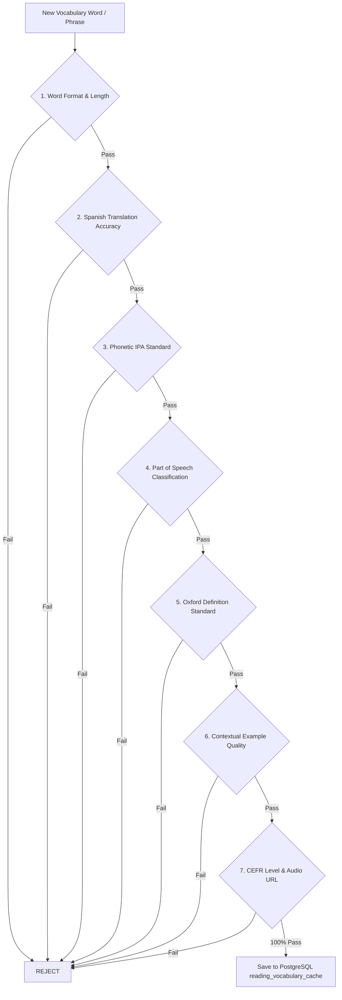

# CELAEST Lexicon Curation & Database Quality Standard

This skill defines the permanent engineering protocol for adding, verifying, and expanding vocabulary in the CELAEST ecosystem. Every word stored in PostgreSQL (`reading_vocabulary_cache`) or served to the Reading Modal must pass **100% of the 8-Point Quality Gate**.

---

## 🏛️ 1. The 8-Point Lexicon Quality Gate

No word may enter the database or cache if it fails ANY of the following 8 criteria:



### Rule 1: Word Format & Length
- **Length**: 2 to 90 characters.
- **Casing**: Strict lowercase (`w = strings.ToLower(strings.TrimSpace(word))`).
- **Allowed Characters**: English letters (`a-z`), hyphens (`-`), spaces (for phrasal verbs/idioms), apostrophes (`'`).
- **Profanity Filter**: Instant rejection of vulgar tokens (`ProfanityBlacklist`).

### Rule 2: Spanish Translation Accuracy
- **Translation Quality**: Must convey the true contextual meaning in professional and everyday Spanish (e.g. `streamline` $\rightarrow$ `optimizar / agilizar procesos`).
- **Anti-Untranslated Filter**: `spanish_translation != word` (unless the word is a verified true cognate in `ValidIdenticalCognates`, e.g., `hotel`, `radio`, `idea`, `doctor`).
- **False Cognate Warnings**: Must explicitly clarify false friends (e.g., `actual` $\rightarrow$ `real / efectivo (falso cognado: no significa actual)`).

### Rule 3: Phonetic (IPA) Standard
- **Enclosure**: Must be wrapped in standard slashes: `/.../` (e.g. `/ˈstriːm.laɪn/`).
- **Acoustic Stress Marks**: Must contain correct primary (`ˈ`) and secondary (`ˌ`) stress marks indicating syllable emphasis.
- **Single Pronunciation**: Never include comma-separated multiple entries (use `cleanIPA`).
- **No Raw Word Placeholders**: Rejects `/'word/` or `/word/` stubs.

### Rule 4: Part of Speech Classification
- Must strictly be one of:
  `noun`, `verb`, `adjective`, `adverb`, `phrasal verb`, `idiom`, `preposition`, `conjunction`, `pronoun`, `interjection`, `determiner`, `article`.

### Rule 5: Oxford Definition Standard (Zero Boilerplate)
- **Minimum Length**: At least 10 characters.
- **Authentic Clarity**: Concise, standard Oxford / Merriam-Webster explanation.
- **FORBIDDEN Synthetic Templates** (Instant Rejection):
  - ❌ *"Standard English vocabulary term denoting..."*
  - ❌ *"Essential ESL vocabulary term meaning..."*
  - ❌ *"General vocabulary term..."*
  - ❌ *"Fundamental English vocabulary term:..."*
  - ❌ *"Key vocabulary term:..."*
  - ❌ *"Plural form of the noun referring to multiple instances..."*
  - ❌ *"Past tense and past participle form of the verb..."*

### Rule 6: Contextual Example Sentence Standard
- **Minimum Length**: At least 15 characters.
- **Authentic Usage**: Must be a natural, realistic sentence from tech, business, or conversational English.
- **FORBIDDEN Synthetic Examples** (Instant Rejection):
  - ❌ *"Understanding the meaning and context of 'X' improves your English comprehension."*
  - ❌ *"Using 'X' in context enhances clarity and professional expression."*
  - ❌ *"The team successfully X-ed the project deliverables on schedule."*
  - ❌ *"Carefully reviewing the X ensures high quality and accuracy."*
  - ❌ *"Maintaining a X approach is essential..."*
  - ❌ *"Our design system ensures a X user experience..."*
  - ❌ *"Having a X mindset is crucial..."*

### Rule 7: CEFR Level
- Must be exactly one of: `A1`, `A2`, `B1`, `B2`, `C1`, `C2`.

### Rule 8: Audio Pronunciation URL
- Must be a valid HTTPS URL pointing to Google TTS endpoint:
  `https://translate.google.com/translate_tts?ie=UTF-8&tl=en&client=tw-ob&q=<urlencoded_word>`

---

## 🛠️ 2. Workflow for Adding New Vocabulary Batches

When expanding the vocabulary:

1. **Step 1: Create a Seed Tier in `celaest-english-back/internal/reading/`**:
   - Create a file `seed_<topic>_<name>.go` (e.g. `seed_oxford_core_expansion_3.go`).
   - Use `makeSeedEntry(word, phonetic, pos, spanish, def, example, cefr)`.
2. **Step 2: Register in `seed_dictionary.go`**:
   - Add `mergeSeedMap(dict, getYourNewVocabulary())` in `getSeedDictionary()`.
3. **Step 3: Run Automated Quality Gate Test**:
   ```bash
   cd c:\Users\user\Music\celaest-english-back
   go test -v -run TestMasterLexiconIntegrity_NoMissingFields ./internal/reading
   ```
4. **Step 4: Synchronize to PostgreSQL**:
   - The Go backend automatically syncs new entries on startup via `repo.SaveVocabularyBatch`, protected by `ValidateWordEntry`.

---

## 🧪 3. PostgreSQL Database Audit Query (Run at Any Time)

Run this SQL query in pgAdmin or CLI to verify 100% database health:

```sql
SELECT COUNT(*) AS total_clean_words FROM reading_vocabulary_cache;

-- Check for ANY defective rows (Expected result: 0 rows)
SELECT word, phonetic, part_of_speech, spanish_translation, definition, example_sentence
FROM reading_vocabulary_cache
WHERE definition ILIKE '%placeholder%'
   OR definition ILIKE '%improves your English comprehension%'
   OR definition LIKE 'Standard English vocabulary%'
   OR definition LIKE 'Essential ESL vocabulary%'
   OR spanish_translation = ''
   OR spanish_translation IS NULL
   OR phonetic = ''
   OR phonetic IS NULL
   OR part_of_speech = ''
   OR part_of_speech IS NULL
   OR definition = ''
   OR definition IS NULL
   OR example_sentence = ''
   OR example_sentence IS NULL;
```
