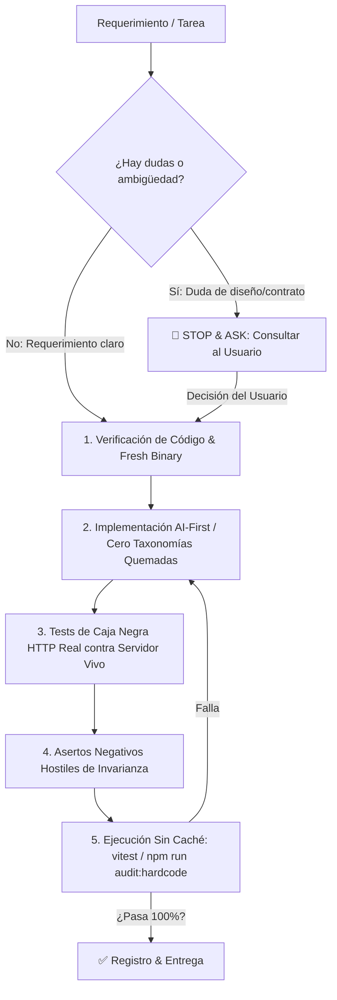

# CELAEST Responsible Testing Gate & Anti-Mock Protocol (Frontend & Cross-Service)

> **Mandato Supremo**: Ninguna tarea, refactorización o corrección se considera completa si depende de mocks engañosos, datos quemados ("hardcoded"), atajos superficiales o si no ha sido verificada contra servicios reales y bases de datos en vivo.

---

## 🏛️ 1. Los 6 Pilares No Negociables de Calidad

---

## 🛑 2. Protocolo "Stop & Ask" (Anti-Atajos)

### El Principio de Oro:
**"Nunca tomes el camino rápido asumiendo por dentro lo que no sabes. Si dudas, DETENTE y PREGUNTA."**

### Cuándo es OBLIGATORIO detenerse y consultar:
1. **Discrepancias de Esquema / Contrato**: Si encuentras diferencias entre el payload del frontend y el modelo del backend (ej. nombres de campos JSON como `repetitionCount` vs `repetitions`, o `level` vs `cefrLevel`), **NO inventes ni adaptes a ciegas**. Consulta cuál es el contrato canónico.
2. **Decisiones de Arquitectura con Compromisos (Trade-offs)**: Si debes elegir entre dos estrategias, expón las opciones al usuario antes de codificar.
3. **Casos Límite no Especificados**: Si no está claro cómo debe comportarse el sistema ante un caso extremo, solicita la directriz de producto.

---

## 🚫 3. Prohibición Absoluta de Taxonomías Quemadas ("Zero-Hardcode")

1. **Espacio de Profesiones Infinito**:
   - NUNCA crees enums, switches cerrados o arrays con listas finitas de profesiones (`HEALTHCARE`, `LEGAL`, etc.) como solución permanente.
   - Toda categorización cerrada representa deuda técnica que fallará ante el primer usuario con una profesión no contemplada (*Acróbata, Soldador Subacuático, Piloto de Drones*).
2. **AI-First Canónico**:
   - La IA (`celaest-core` / IA-Mesh) es el motor generativo abierto: recibe la profesión en lenguaje natural y genera contenido auténtico adaptado al nivel CEFR.
3. **Contingencia Procedural Abierta**:
   - En caso de desconexión o contingencia, los fallbacks deben usar **plantillas procedurales paramétricas** universales que interpolen la profesión y utilicen tokens funcionales estructurales (~80 palabras de estructura inglesa), jamás historias fijas por categorías quemadas ni comodines genéricos ciegos como `BUSINESS`.

---

## 🧪 4. Protocolo de Pruebas de Frontend y E2E (Zero-Mocks)

1. **Anti-Hardcode Linter (`npm run audit:hardcode`)**:
   - Debe ejecutarse en cada verificación para comprobar que no existan defaults ciegos como `"Product Manager"` o `"Software & Technology"`.
2. **Invarianza Multi-Dominio (`multiDomainInvariance.test.ts`)**:
   - Debe probar dinámicamente profesiones arbitrarias del mundo real (*Médico, Sumiller, Arqueólogo, Apicultor, Astrofísico*) y verificar la ausencia de términos de software en preguntas y retroalimentación.
3. **Verificación de Tipos Estricta**:
   - `npm run typecheck` (`tsc --noEmit`) debe pasar con 0 errores antes de dar por cerrada cualquier tarea.
